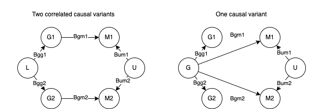

Neighbouring CpGs are correlated. This is partly due to shared genetic effects, and partly due to non-shared genetic effects. When the two CpGs have different 'top SNPs', there are two potential mechanisms occurring:



We can get the expected correlations between CpG1 ($m_1$) and CpG2 ($m_2$) before and after SNP adjustment as below. Start by defining the data generating process for $m_1$ and $m_2$ when there are two causal variants:

$$
m_* = \beta_{g_*,m_*}g_* + \beta_{um_*}u + e_*
$$

and when there is one causal variant:

$$
m_* = \beta_{g,m_*}g + \beta_{um_*}u + e_*
$$

where $m_*$ could be methylation site $m_1$ or $m_2$, $e_* \sim N(0, \sigma^2_{e_*})$ and in principle $g_* \sim Binom(2, p_*)$ where $p_*$ is the allele frequency but in practice it's easier to just simulate it as $g_* \sim N(p, 2p(1-p))$. The two SNPs $g_1$ and $g_2$ are correlated due to a shared underlying SNP, so in the case of the single causal variant model, $g$ is causal for both $m_1$ and $m_2$ and $g_1$ and $g_2$ are simply correlated with $g$ with $R^2_{g_*}$, with a data generating process $g_* = \alpha_{g,g_*} + \beta_{g,g_*}g + e_{g_*}$ where $e_{g_*} \sim N(0, 2p_*(1-p_*)-2\beta_{g,g_*}^2p(1-p))$, $\beta_{g,g_*} = \sqrt{2R^2_{g_*}p_1(1-p_1)/2p(1-p)}$ and $\alpha_{g,g_*} = p_1 - \beta_{g,g_*}p$. In the case of two causal variants, $g_1$ and $g_2$ are generated in the same way, however they are each causal for $m_1$ and $m_2$ respectively. 

In the two causal variant scenario the expected correlation between $m_1$ and $m_2$ is

$$
\begin{eqnarray}
Cor(m_1, m_2) =& \frac{Cov(m_1, m_2)}{\sqrt(Var(m_1) Var(m_2))} \\
=& \frac{Cov(\beta_{gm1}g_1 + \beta_{um1}u + e_1, \beta_{gm}g_2 + \beta_{um2}u + e_2)}{(\beta_{gm1}Var(g) + \beta_{um1}Var(u) + \sigma^2_{e_1})(\beta_{gm2}Var(g) + \beta_{um2}Var(u) + \sigma^2_{e_2})} \\
=& \frac{\beta_{um1}\beta_{um2}Var(u) + Cov()}{}
\end{eqnarray}
$$
Argh I need to finish this but running out of time sorry... but essentially it will be approximately as follows

Before adjustment

$$
cor(m1, m2)^2 = \frac{(\beta_{gm}^2\beta_{gg1}\beta_{gg2}Var(g) + \beta_{um}^2Var(U))^2}{(\beta_{gm1}Var(g)+\beta_{um1}Var(U)+\sigma^2_{e1})(\beta_{gm2}Var(g)+\beta_{um2}Var(U)+\sigma^2_{e2})}
$$

And after adjustment it will be the same but with genetic values removed

$$
cor(m1, m2)^2 = \frac{(\beta_{um}^2Var(U))^2}{(\beta_{um1}Var(U)+\sigma^2_{e1})(\beta_{um2}Var(U)+\sigma^2_{e2})}
$$

So the intuition here is that if the trait is more heritable then the correlation will drop after adjustment. Under certain circumstances of two causal variants and large $\beta_{um}$ (confounding) I think you could see the adjusted correlation being higher than the unadjusted correlation. Run simulations to check


## Simulations

```{r}
library(dplyr)
library(ggplot2)
```

Generate correlated genotypes for given frequencies and rsq value

```{r}
generate_correlated_g <- function(n, p1, p2, rsq)
{
  p <- mean(c(p1,p2))
  rsq1 <- sqrt(rsq)
  b1 <- sqrt(rsq1 * 2*p1*(1-p1) / (2*p*(1-p)))
  b2 <- sqrt(rsq1 * 2*p2*(1-p2) / (2*p*(1-p)))
  a1 <- p1 - b1*p
  a2 <- p2 - b2*p
  ve1 <- 2*p1*(1-p1) - b1^2*2*p*(1-p)
  ve2 <- 2*p2*(1-p2) - b2^2*2*p*(1-p)
  g <- rnorm(n, p, sqrt(2*p*(1-p)))
  g1 <- a1 + b1 * g + rnorm(n, 0, sqrt(ve1))
  g2 <- a2 + b2 * g + rnorm(n, 0, sqrt(ve2))
  # mean(g1)
  # mean(g2)
  # var(g1)
  # var(g2)
  # cor(g1,g2)^2
  return(tibble(g1,g2,g))
}
```

Simulations to look at how m1-m2 correlations change after adjustment under different models. Select parameters

```{r}
param <- expand.grid(
  rsq=seq(0.1, 1, by=0.1),
  bum=c(0, 1, 5),
  bgm=c(0, 1, 5),
  nid=10000
)
```


Single causal variant, adjusting for causal variant

```{r}
fn0 <- function(rsq, bgm, bum, nid) {
  g <- generate_correlated_g(nid, 0.5, 0.5, rsq)
  u <- rnorm(nid)
  m1 <- g$g * bgm + u * bum + rnorm(nid)
  m2 <- g$g * bgm + u * bum + rnorm(nid)
  m1r <- residuals(lm(m1 ~ g$g))
  m2r <- residuals(lm(m2 ~ g$g))
  tibble(
    cor_orig=cor(m1, m2), 
    cor_resid=cor(m1r, m2r)
  )
}
out0 <- lapply(1:nrow(param), function(i) do.call(fn0, param[i,])) %>% bind_rows() %>% {cbind(param,.)} 
```

Single causal variant, adjusting for tag SNPs

```{r}
fn1 <- function(rsq, bgm, bum, nid) {
  g <- generate_correlated_g(nid, 0.5, 0.5, rsq)
  u <- rnorm(nid)
  m1 <- g$g * bgm + u * bum + rnorm(nid)
  m2 <- g$g * bgm + u * bum + rnorm(nid)
  m1r <- residuals(lm(m1 ~ g$g1))
  m2r <- residuals(lm(m2 ~ g$g2))
  tibble(
    cor_orig=cor(m1, m2), 
    cor_resid=cor(m1r, m2r)
  )
}
out1 <- lapply(1:nrow(param), function(i) do.call(fn1, param[i,])) %>% bind_rows() %>% {cbind(param,.)} 
```

Two causal variants, adjusting for causal variants

```{r}
fn2 <- function(rsq, bgm, bum, nid) {
  g <- generate_correlated_g(nid, 0.5, 0.5, rsq)
  u <- rnorm(nid)
  m1 <- g$g1 * bgm + u * bum + rnorm(nid)
  m2 <- g$g2 * bgm + u * bum + rnorm(nid)
  m1r <- residuals(lm(m1 ~ g$g1))
  m2r <- residuals(lm(m2 ~ g$g2))
  return(tibble(
    cor_orig=cor(m1, m2), 
    cor_resid=cor(m1r, m2r)
  ))
}
out2 <- lapply(1:nrow(param), function(i) do.call(fn2, param[i,])) %>% bind_rows() %>% {cbind(param,.)}
```

Two causal variants, adjusting for single tag SNP

```{r}
fn3 <- function(rsq, bgm, bum, nid) {
  g <- generate_correlated_g(nid, 0.5, 0.5, rsq)
  u <- rnorm(nid)
  m1 <- g$g1 * bgm + u * bum + rnorm(nid)
  m2 <- g$g2 * bgm + u * bum + rnorm(nid)
  m1r <- residuals(lm(m1 ~ g$g))
  m2r <- residuals(lm(m2 ~ g$g))
  return(tibble(
    cor_orig=cor(m1, m2), 
    cor_resid=cor(m1r, m2r)
  ))
}
out3 <- lapply(1:nrow(param), function(i) do.call(fn3, param[i,])) %>% bind_rows() %>% {cbind(param,.)}
```

Plot

```{r}
out <- bind_rows(
  out0 %>% mutate(what="1cv_incomplete"),
  out1 %>% mutate(what="1cv"), 
  out2 %>% mutate(what="2cv"), 
  out3 %>% mutate(what="2cv_incomplete")
)
ggplot(out, aes(x=rsq, y=cor_orig - cor_resid)) +
  geom_point(aes(colour=what)) +
  geom_hline(yintercept=0, linetype="dotted") +
  facet_grid(bum ~ bgm, labeller = label_both) +
  scale_colour_brewer(type="qual")
```

- `1cv` = m1 and m2 have a single causal variant, and we adjust only for that variant
- `1cv_incomplete` = m1 and m2 have a single causal variant, but we adjust each for a different tag SNP
- `2cv` = two causal variants, adjusted directly for those
- `2cv_incomplete` = two causal variants, but adjusting only for a single tag SNP
- `bgm` = effect of genotype(s) on m1 and m2
- `bum` = effect of non-genetic factor on m1 and m2

## Summary

- Residual correlation is generally smaller than the original correlation when heritability is high
- Residual correlation and adjusted correlation are very similar when heritability is low
- If there are two correlated causal variants, then the adjusted correlation can be higher than the original correlation. However this requires the rsq between g1 and g2 to be relatively small and there is a large non-genetic shared effect.
- One explanation for ARIES / BiB differences is that there is higher confounding of m1-m2 in BiB


## Other questions

- Sometimes the mQTL doesn't associate in BiB, but adjusting for it still changes the cor(m1,m2)?
- Unclear what mechanism could give rise to higher confounding in BiB / SABRE compared to ARIES. 

## Other stuff (unfinished)

Read in summary table

```{r}
dat <- read.csv("aries_bib_summary.csv")
str(dat)
```


```{r}
dat <- dat %>% mutate(
  aries_snp12same = aries_snp1_chrpos == aries_snp2_chrpos
)
table(dat$aries_snp12same)
```

Mostly looks like m1 and m2 have different mQTLs

Is the top SNP for m1 and m2 selected in ARIES, or selected in GoDMC? Assuming that it's selected in GoDMC and then the same top SNPs are used in ARIES and BiB.

Quick look at what residuals should look like after adjusting for a SNP

```{r}
n <- 1000
g <- rbinom(n, 2, 0.5)
u <- rnorm(n)
m1 <- g + u + rnorm(n)
m2 <- g + u + rnorm(n)

cor(m1, m2)
m1r <- residuals(lm(m1 ~ g))
m2r <- residuals(lm(m2 ~ g))
plot(m1r ~ m1)
```

In the investigation document sometimes there was a cloud of points, assume this is because of imputed genotype probabilities being used rather than hard calls?

```{r}
summary(lm(aries_cor.change ~ log10(aries_snp2_pval), dat))
summary(-log10(dat$bib_snp1_pval))
summary(-log10(dat$aries_snp1_pval))
table(dat$aries_snp1_pval < 0.05)
table(dat$bib_snp1_pval < 0.05)
```


Add rsq values

```{r}
dat %>%
  ggplot(., aes(aries_cor.change, aries_rsq1+aries_rsq2)) +
  geom_point()
```


